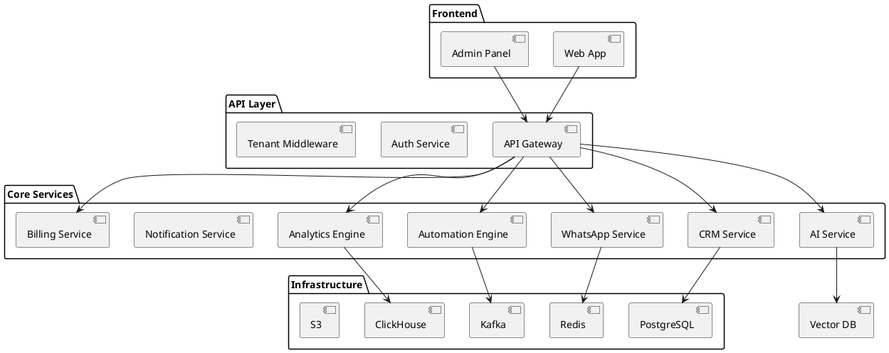
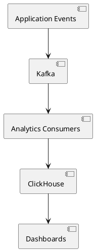
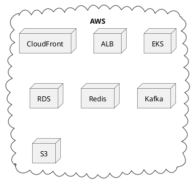

# SPEC-001-DentFlo Enterprise Architecture

## Background

O DentFlo é uma plataforma SaaS enterprise multi-tenant para clínicas odontológicas, desenvolvida para atuar como o sistema operacional inteligente da clínica.

O objetivo do produto não é apenas organizar pacientes ou servir como CRM.

O DentFlo foi concebido para:

- aumentar faturamento
- recuperar receita perdida
- automatizar relacionamento
- reduzir faltas
- aumentar recorrência
- automatizar retenção
- centralizar operações
- gerar inteligência operacional
- fornecer analytics avançado
- criar dependência operacional positiva

A plataforma deverá suportar milhares de clínicas, milhões de eventos, milhões de mensagens e arquitetura IA-ready.

---

# Requirements

## Must Have

### Core SaaS

- Arquitetura multi-tenant enterprise
- Isolamento completo por tenant
- RBAC granular
- JWT + Refresh Token + MFA
- Billing SaaS automatizado
- APIs REST enterprise
- Event-driven architecture
- Escalabilidade horizontal
- Logs e auditoria
- Observabilidade completa
- LGPD compliance

### CRM Odontológico

- Cadastro pacientes
- Cadastro leads
- Pipeline CRM
- Timeline unificada paciente
- Agenda inteligente
- Tratamentos
- Procedimentos
- Histórico clínico
- Campanhas
- Automação follow-up

### WhatsApp Enterprise

- Múltiplas sessões
- QR Code connection
- Campanhas em massa
- Templates
- Filas distribuídas
- Chat centralizado
- SLA atendimento
- Distribuição automática
- Logs completos

### Motor de Automação

- Workflow visual
- Triggers
- Condições
- Ações
- Retries
- Jobs assíncronos
- Agendamento automações

### Analytics & BI

- Dashboard executivo
- KPIs clínicos
- KPIs financeiros
- KPIs retenção
- ROI campanhas
- Receita recuperada
- Benchmark clínicas

### IA

- IA follow-up
- IA campanhas
- IA previsão churn
- IA score paciente
- IA insights gestão
- IA recuperação pacientes
- AI agents
- embeddings
- vector search

---

## Should Have

- Marketplace integrações
- API pública
- White label parcial
- Multiunidade
- ERP odontológico
- Predictive analytics
- Autopilot mode

---

## Could Have

- App mobile
- Voice AI
- Omnichannel
- Marketplace templates
- AI voice agents

---

## Won't Have Initially

- ERP contábil completo
- Marketplace aberto terceiros
- Videochamada interna
- IA on-premise

---

# Method

# Arquitetura Geral

A arquitetura será baseada em:

- Distributed Modular Monolith inicialmente
- Event-Driven Architecture
- Service-Oriented Design
- Horizontal Scalability
- Cloud Native Infrastructure
- AI-ready Architecture

A plataforma será preparada desde o início para evolução gradual para microserviços.

---

# Stack Tecnológica

## Frontend

| Tecnologia | Uso |
|---|---|
| Next.js | Frontend principal |
| TypeScript | Type safety |
| TailwindCSS | UI styling |
| shadcn/ui | Design system |
| Zustand | Estado global |
| React Query | Data fetching |
| Socket.IO Client | Real-time |
| React Hook Form | Forms |
| Zod | Validation |

---

## Backend

| Tecnologia | Uso |
|---|---|
| NestJS | Backend framework |
| Fastify | HTTP server |
| TypeScript | Core language |
| Prisma ORM | ORM |
| PostgreSQL | Primary database |
| Redis | Cache + filas |
| BullMQ | Workers e filas |
| Socket.IO | Real-time |
| Kafka | Event streaming |
| ClickHouse | Analytics |

---

## Infraestrutura

| Tecnologia | Uso |
|---|---|
| AWS | Cloud principal |
| EKS | Kubernetes |
| Docker | Containers |
| Terraform | Infra as code |
| CloudFront | CDN |
| S3 | Storage |
| RDS PostgreSQL | Banco |
| ElastiCache Redis | Cache |
| MSK Kafka | Event bus |

---

## Observabilidade

| Tecnologia | Uso |
|---|---|
| Grafana | Dashboards |
| Prometheus | Metrics |
| Loki | Logs |
| OpenTelemetry | Tracing |
| Sentry | Error tracking |

---

# Arquitetura de Serviços



---

# Multi-Tenant Architecture

## Estratégia

Modelo:

- Shared Database
- Shared Schema
- tenant_id obrigatório
- Row Level Security
- Tenant-aware middleware

Toda tabela obrigatoriamente possuirá:

```sql
tenant_id UUID NOT NULL
```

---

## Tenant Isolation

Isolamentos:

- banco
- cache
- websocket
- filas
- analytics
- autenticação
- storage

---

## Middleware Tenant-Aware

Fluxo:

1. JWT recebido
2. tenant_id extraído
3. contexto tenant carregado
4. permissões carregadas
5. RLS aplicado
6. cache namespace aplicado

---

# Banco de Dados

## PostgreSQL

Banco transacional principal.

### Principais tabelas

## tenants

```sql
id
name
plan_id
status
created_at
```

## users

```sql
id
tenant_id
name
email
password_hash
role
mfa_enabled
last_login
```

## patients

```sql
id
tenant_id
name
phone
email
birth_date
health_score
status
```

## leads

```sql
id
tenant_id
pipeline_stage
source
score
assigned_to
```

## appointments

```sql
id
tenant_id
patient_id
dentist_id
scheduled_at
status
confirmed
```

## campaigns

```sql
id
tenant_id
name
channel
status
trigger_type
```

## automation_workflows

```sql
id
tenant_id
name
workflow_json
active
```

## whatsapp_sessions

```sql
id
tenant_id
session_name
status
last_seen
```

## billing_subscriptions

```sql
id
tenant_id
plan_id
status
gateway
next_payment
```

---

# Event-Driven Architecture

Todos os módulos deverão publicar eventos.

---

## Event Bus

Tecnologia:

- Apache Kafka

---

## Eventos Principais

| Evento | Descrição |
|---|---|
| patient.created | Paciente criado |
| appointment.scheduled | Agendamento criado |
| appointment.missed | Falta registrada |
| whatsapp.message.sent | Mensagem enviada |
| payment.approved | Pagamento aprovado |
| campaign.executed | Campanha executada |
| automation.triggered | Automação iniciada |
| nps.received | NPS recebido |

---

# WhatsApp Enterprise

## Arquitetura

Separado como serviço isolado.

Funções:

- gerenciamento sessões
- filas envio
- retries
- rate limiting
- webhook processing
- media processing
- chatbot

---

## Filas

BullMQ + Redis.

Filas:

- outbound_messages
- campaign_dispatch
- retry_queue
- webhook_processing
- media_processing

---

## Estratégia Escalabilidade

- workers horizontais
- queue partitioning
- retry exponential backoff
- rate limiting por tenant

---

# Automation Engine

## Estrutura Workflow

```json
{
  "trigger": {},
  "conditions": [],
  "actions": []
}
```

---

## Triggers

- paciente faltou
- aniversário
- orçamento parado
- sem retorno
- NPS baixo
- pagamento pendente

---

## Actions

- WhatsApp
- email
- SMS
- webhook
- task creation
- CRM update
- internal notification

---

## Execução

- totalmente assíncrona
- baseada em filas
- retry automático
- idempotência
- dead letter queue

---

# Analytics Architecture

## Estratégia

Separar analytics do banco transacional.

---

## Pipeline



---

## KPIs

### Clínicos

- comparecimento
- faltas
- retorno
- tratamentos fechados
- score paciente

### Financeiros

- MRR
- ARR
- receita recuperada
- ticket médio
- inadimplência

### Marketing

- ROI campanhas
- conversão
- taxa resposta
- CAC
- LTV

---

# Inteligência Artificial

## Arquitetura IA

Separada como AI Service.

---

## Componentes

| Componente | Função |
|---|---|
| LLM Gateway | Orquestra IA |
| Embedding Engine | Vetorização |
| Vector Database | Memória |
| AI Agents | Automação |
| Prompt Service | Templates |

---

## IA Features

- geração mensagens
- previsão faltas
- previsão churn
- previsão faturamento
- follow-up automático
- insights operacionais
- score paciente

---

## Stack IA

| Tecnologia | Uso |
|---|---|
| OpenAI | LLM |
| LangChain | Orquestração |
| pgvector | Vetores |
| Temporal | AI workflows |

---

# Billing Architecture

## Gateways

- Asaas
- Stripe
- Mercado Pago

---

## Fluxo Billing

```plantuml
@startuml

[Customer Payment]
 --> [Gateway]
 --> [Webhook]
 --> [Billing Service]
 --> [Tenant Activation]

@enduml
```

---

## Recursos

- assinatura mensal
- trial
- PIX recorrente
- retries automáticos
- grace period
- downgrade
- upgrade
- retenção cancelamento

---

# Segurança

## Autenticação

- JWT access token
- refresh token
- MFA
- session management

---

## Proteções

- rate limiting
- API throttling
- encryption at rest
- encryption in transit
- WAF
- audit logs
- RBAC granular
- RLS PostgreSQL

---

## Compliance

- LGPD
- consent tracking
- data retention policies
- exportação dados
- anonimização

---

# Observabilidade

## Monitoramento

- métricas aplicação
- métricas filas
- métricas workers
- métricas tenants
- métricas APIs

---

## Alertas

- fila congestionada
- falha webhook
- downtime tenant
- falha billing
- erro IA
- aumento latência

---

# Escalabilidade

## Estratégia

Preparado para:

- milhares tenants
- milhões mensagens
- milhões eventos
- milhares conexões websocket

---

## Técnicas

- horizontal scaling
- stateless APIs
- distributed queues
- Redis cluster
- Kafka partitioning
- CDN
- autoscaling Kubernetes
- read replicas PostgreSQL

---

# APIs

## REST API

Padrão:

```http
/api/v1
```

---

## Módulos API

- auth
- tenants
- patients
- crm
- appointments
- campaigns
- automations
- whatsapp
- billing
- analytics
- ai

---

## Webhooks

- payment events
- WhatsApp events
- automation callbacks
- AI callbacks

---

# Dashboard Receita Recuperada

## Objetivo

Mostrar claramente ROI gerado pelo DentFlo.

---

## KPIs

- pacientes recuperados
- receita recuperada
- oportunidades abertas
- receita potencial perdida
- faturamento incremental

---

## Exemplo

```text
R$ 84.300 recuperados nos últimos 30 dias.
```

---

# Patient Health Score

## Variáveis

- frequência
- comparecimento
- pagamentos
- recorrência
- respostas
- comportamento
- tratamentos pendentes

---

## Classificação

| Score | Risco |
|---|---|
| 0-30 | Alto |
| 31-70 | Médio |
| 71-100 | Baixo |

---

# DentFlo Autopilot

## Objetivo

Sistema automatizado de retenção inteligente.

---

## Funções

- detectar oportunidades
- recuperar pacientes
- enviar campanhas
- prever faltas
- otimizar agenda
- sugerir ações
- executar workflows

---

# Infraestrutura Cloud

## AWS Architecture



---

# CI/CD

## Pipeline

- GitHub Actions
- Docker Build
- Automated Tests
- Security Scan
- Deploy Kubernetes

---

# Implementation

## Fase 1 — Core MVP

- Auth
- CRM
- Agenda
- WhatsApp
- Campanhas
- Automações básicas

Duração estimada:

3-5 meses

---

## Fase 2 — Enterprise SaaS

- Multi-tenant
- Billing
- RBAC
- Painel master
- Analytics inicial

Duração:

2-3 meses

---

## Fase 3 — Analytics & IA

- BI avançado
- Event tracking
- AI service
- Previsões
- Benchmark
- Health score

Duração:

3-4 meses

---

## Fase 4 — Ecossistema

- Marketplace
- APIs públicas
- ERP odontológico
- AI agents
- Autopilot

Duração:

4-6 meses

---

# Milestones

| Milestone | Objetivo |
|---|---|
| M1 | CRM operacional |
| M2 | WhatsApp enterprise |
| M3 | Automações visuais |
| M4 | Billing SaaS |
| M5 | Analytics |
| M6 | IA Follow-up |
| M7 | Autopilot |
| M8 | Plataforma enterprise completa |

---

# Gathering Results

## KPIs Produto

- MRR
- ARR
- churn
- retenção clínicas
- tempo resposta
- mensagens enviadas
- automações executadas
- pacientes recuperados
- receita recuperada

---

## KPIs Técnicos

- uptime
- latência
- throughput filas
- tempo processamento
- falhas workers
- custo infraestrutura

---

## Objetivo Final

Transformar o DentFlo no principal sistema operacional inteligente para clínicas odontológicas do Brasil.

---

# Feature Coverage Matrix

## Core Product Vision

- sistema operacional da clínica
- plataforma retenção inteligente
- motor automação
- CRM odontológico
- analytics odontológico
- IA-driven platform
- recuperação receita
- relacionamento automatizado
- inteligência comercial

---

## Multi-Tenant

- tenant_id obrigatório
- isolamento banco
- isolamento cache
- isolamento websocket
- isolamento filas
- isolamento autenticação
- isolamento analytics
- middleware tenant-aware
- row level security
- RBAC multi-tenant
- tracking multi-tenant

---

## Segurança

- JWT
- refresh token
- MFA
- RBAC
- permissões granulares
- auditoria
- logs administrativos
- controle sessões
- rate limiting
- criptografia
- proteção APIs
- LGPD
- impersonate login
- logs acessos
- logs alterações
- trilha auditoria

---

## Billing

- assinatura mensal
- trial
- PIX recorrente
- cartão
- boleto
- upgrade plano
- downgrade plano
- cancelamento
- inadimplência
- retries automáticos
- grace period
- reativação automática
- subscriptions
- invoices
- payments
- billing logs
- webhooks
- automações cobrança
- MRR
- ARR
- churn
- LTV
- CAC
- inadimplência
- ARPU

---

## Painel Administrativo Master

- visualizar tenants
- bloquear tenant
- alterar planos
- impersonate login
- visualizar billing
- visualizar logs
- visualizar filas
- visualizar workers
- visualizar falhas
- visualizar eventos
- visualizar uso APIs
- visualizar saúde tenants
- dashboard financeiro global

---

## CRM Odontológico

- pacientes
- leads
- tratamentos
- procedimentos
- campanhas
- pipeline
- tarefas
- histórico
- agendamentos
- pagamentos
- observações
- anexos
- tags
- score paciente
- score lead
- timeline completa
- filtros avançados

---

## Pipeline CRM

- lead novo
- avaliação
- orçamento
- follow-up
- negociação
- fechado
- perdido

---

## Timeline Única Paciente

- mensagens
- respostas
- campanhas
- agendamentos
- faltas
- comparecimentos
- pagamentos
- tratamentos
- observações
- automações executadas
- score paciente

---

## WhatsApp Enterprise

- múltiplas sessões
- QRCode conexão
- reconexão automática
- disparo individual
- disparo massa
- campanhas
- templates
- mídia
- chatbot
- filas envio
- rate limit
- retries
- logs entrega
- logs leitura
- logs resposta
- múltiplos atendentes
- distribuição automática
- chats internos
- SLA atendimento
- transferência conversa
- respostas rápidas
- tracking eventos mensagem

---

## Motor Automação

### Triggers

- paciente faltou
- aniversário
- sem retorno
- orçamento parado
- pós procedimento
- pagamento pendente
- reativação
- abandono
- NPS
- no-show

### Condições

- respondeu?
- agendou?
- pagou?
- score paciente?
- ticket médio?

### Ações

- WhatsApp
- e-mail
- SMS
- tarefa
- tag
- webhook
- CRM update
- notificação interna

### Recursos

- workflow visual
- automações recorrentes
- retries
- filas assíncronas

---

## Agenda Inteligente

- confirmação automática
- lembretes automáticos
- reagendamento
- encaixe automático
- fila espera
- previsão faltas
- prevenção no-show
- IA previsão faltas
- IA sugestão horários
- IA detecção padrões

---

## KPIs & BI

- pacientes recuperados
- receita recuperada
- taxa retorno
- frequência retorno
- lifetime value paciente
- tempo médio retorno
- ROI campanhas
- conversão campanhas
- comparecimento
- faltas
- ticket médio
- faturamento
- recorrência
- receita paciente
- taxa resposta WhatsApp
- tratamentos fechados

---

## Receita Recuperada

- pacientes recuperados
- oportunidades recuperação
- valor potencial perdido
- valor recuperado DentFlo
- dashboard ROI

---

## Calculadora Receita Perdida

- pacientes inativos
- ticket médio
- potencial perdido
- potencial recuperação

---

## Patient Health Score

- frequência
- faltas
- pagamentos
- respostas
- recorrência
- tratamentos
- comportamento
- classificação abandono

---

## Inteligência Artificial

- IA follow-up
- IA campanhas
- IA copy mensagens
- IA previsão faturamento
- IA previsão retorno
- IA previsão churn
- IA score paciente
- IA melhor horário contato
- IA insights gestão
- IA recuperação pacientes
- embeddings
- vetorização
- memória contextual
- AI agents
- AI analytics

---

## IA Follow-Up Automático

- gerar mensagens
- gerar follow-ups
- personalizar campanhas
- adaptar tom comunicação
- análise histórico paciente
- análise procedimento
- análise comportamento
- análise estágio CRM

---

## DentFlo Autopilot

- detectar oportunidades
- recuperar pacientes
- enviar campanhas
- reduzir faltas
- otimizar horários
- sugerir ações
- executar automações

---

## Google Reviews

- solicitar avaliação automática
- detectar NPS alto
- enviar link Google Review

---

## NPS Automático

- envio automático
- alerta interno nota baixa
- tarefa recuperação
- solicitar review Google

---

## Benchmark Clínicas

- benchmark anônimo
- comparação taxas retorno
- comparação KPIs

---

## Tracking Eventos

- login
- mensagem enviada
- mensagem lida
- resposta
- clique
- agendamento
- comparecimento
- falta
- pagamento
- retorno
- abertura campanha
- alteração CRM
- event bus
- analytics pipeline
- event store

---

## Financeiro Clínica

- contas receber
- fluxo caixa
- pagamentos pacientes
- inadimplência
- conciliação
- previsões
- faturamento mensal
- recorrência
- margem
- receita recuperada

---

## Observabilidade

- logs centralizados
- tracing
- monitoramento
- alertas
- auditoria
- backups
- disaster recovery

---

## Escalabilidade

- horizontal scaling
- filas distribuídas
- workers distribuídos
- cache distribuído
- CDN
- microsserviços futuros
- milhões eventos
- milhões mensagens

---

# Need Professional Help in Developing Your Architecture?

Please contact me at https://sammuti.com :)

